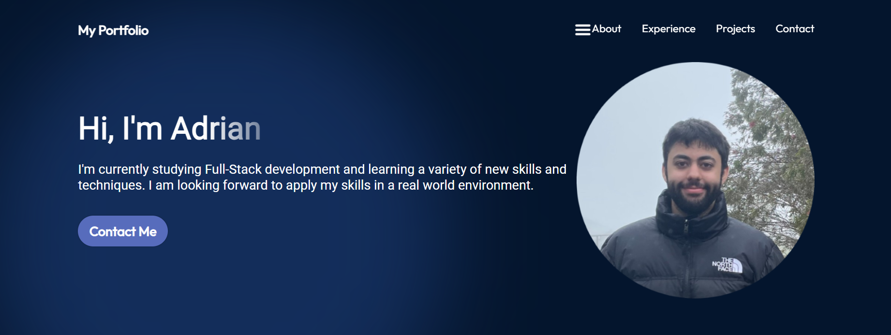
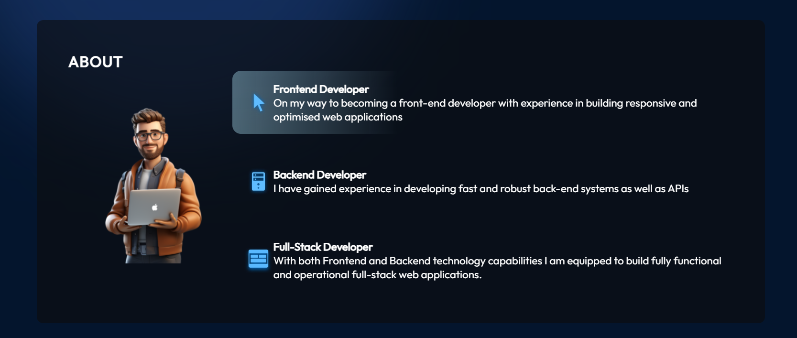
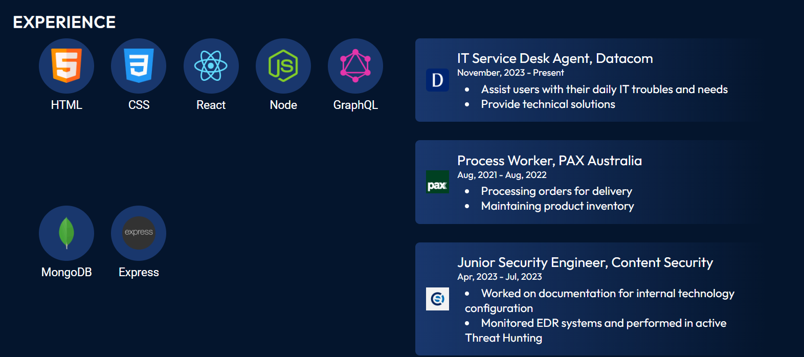
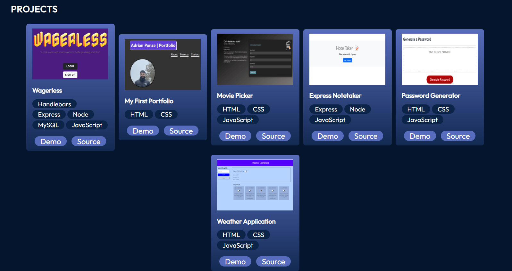
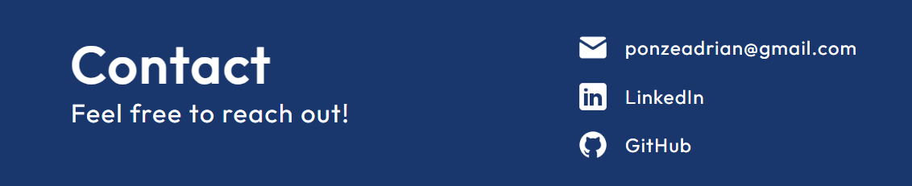

# React Portfolio

## Description

This project is a personal portfolio which is built using React. My motivation for this project was to build something I could showcase to potential future employers and be able to stand out from others. 

## Problem Solving

This project aims at providing a well made portfolio to showcase.

## Learning

Throughout building this project, I learned how components work as well as many other React features. It was interesting to see everything come together and work.

## Table of Contents

- [Installation](#installation)

- [Usage](#usage)

- [License](#license)

- [Contributing](#contributing)

- [Tests](#tests)

- [Questions](#questions)

## Installation

To install and run this project locally, follow these steps:

1. Clone the repository to your local machine.
    
    git clone git@github.com:Y1va/React-Portfolio.git

2. Open the project folder in your code editor.

3. Install the necessary dependencies by running the command:

    `npm install`

4. After the necessary dependencies have been installed you can run the following command:

    `npm run dev`

## Usage

Once the application is running on the local host, the below screenshots will be able to be viewed. Although I didn't include screenshots of the mobile version of the app, this portfolio is perfectly responsive. Feel free to try it out yourself!

* This is the navbar and hero section of my portfolio

* About section: Shows a description of some of the skills I have deloped throughout my learning journey.

*  Experience: This section shows my most previous work experience and technical skills I posses.

* Projects: Showcase of some of the projects that I have completed throughout the Coding Bootcamp.

* Contact: Footer for the contact section and ways to reach me as well as view my linkedIn and github profiles.

## Deployed Application on Netlify

You can view my deployed React portfolio hosted on Netlify using this [link](https://adrianponzereactportfolio.netlify.app).

## License

    This project is licensed under the MIT License

## Contributing

I will not be accepting contributions to this repository at this time.

## Tests

N/A

## Questions

If you have any questions, feel free to reach out to me at ponzeadrian@gmail.com. Find my other projects at [Y1va](https://github.com/Y1va/).